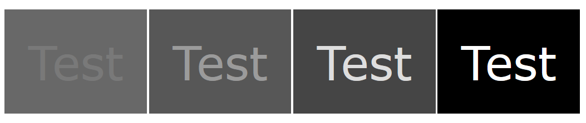
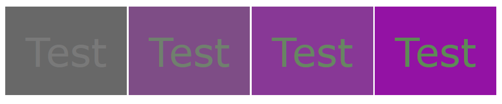

# Contrast

The color used for text and icons
needs to be sufficiently different
from the background color
to be easily seen.

Insufficient contrast affects reading speed,
and measuring contrast is also important
to ensure accessibility,
including for those with low vision (Legge 1987):

> People with low vision usually require large characters to read, so high contrast is particularly important for them.

For people with normal vision,
even when reading low-contrast text,
increasing the character size makes it possible to maintain
same maximum reading speed as when reading high-contrast text
(Fujita _et. al._).

## Luminance and chromatic contrast

Contrast can be produced by sufficient difference in lightness _(luminance contrast)_,
and also by sufficient difference in hue or chroma _(chromatic contrast)_.





Studies (Legge 1990) of both people with normal color vision,
and people with low vision,
have shown that sufficient luminance contrast
is the primary factor affecting reading speed,
and that adding chromatic contrast does not further increase reading speed.
This is true for both those with low vision and those with normal vision.

Color.js provides several methods to estimate luminance contrast.
The strengths, drawbacks and uses of these methods have been examined by
the NASA (Color Usage Research Lab).

Each contrast algorithm can be used via either its dedicated function name,
or the general `contrast()` function:

```js
let color1 = new Color("p3", [0.9, 0.8, 0.1]);
let color2 = new Color("slategrey");
let contrast = color1.contrastWCAG21(color2);
let sameContrast = color1.contrast(color2, "WCAG21");
// Case insensitive:
let sameContrast2 = color1.contrast(color2, "wcag21");
```

Warning: You *need* to provide a contrast algorithm to `contrast()`.
Not providing one produces a `TypeError`:

```js
Color.contrast("red", "white");
```

## Weber Contrast

Weber contrast, also often simply called Luminance Contrast,
is the relationship between the luminance Y<sub>max</sub>
of a brighter area of interest
and that of an adjacent darker area, Y<sub>min</sub>.
It is commonly used in lighting design,
and also to examine small, sharp edged symbols and text
on larger, uniformly-colored backgrounds.

> WC = Y<sub>max</sub> - Y<sub>min</sub> / Y<sub>min</sub>

Any two colors can be used,
and this formula does not care which is the text color and which is the background.
The lighter of the two will be detected automatically.

```js
let color1 = new Color("p3", [0.9, 0.8, 0.1]);
let color2 = new Color("slategrey");
let contrast = color1.contrast(color2, "weber");
```

### Modified Weber Contrast

Weber contrast is typically used with printed test charts
with positive polarity (black text, white background).
The formula thus can be expressed as:

> WC<sub>pp</sub> = Y<sub>background</sub> - Y<sub>text</sub> / Y<sub>text</sub>

Hwang and Peli used a modified Weber contrast for
tablet-based, negative polarity testing (white text on black background),
and wrote:

> We found that our app generates more accurate and a wider range of contrast stimuli than the paper chart (especially at the critical high CS, low contrast range), and found a clear difference between NP and PP CS measures (CSNP>CSPP) despite the symmetry afforded by the modified Weber contrast definition. Our app provides a convenient way to measure CS in both lighted and dark environments.

The formula for negative polarity is

> WC<sub>np</sub> = Y<sub>text</sub> - Y<sub>background</sub> / Y<sub>text</sub>


## Michelson Contrast

Michelson Contrast, also called Modulation or Peak-to-Peak Constrast,
measures the relation between the **spread** and the **sum** of the two luminances.
This definition is derived from signal processing theory,
where it is used to determine the quality of a signal relative to its noise level.

> MC = (Y<sub>max</sub> - Y<sub>min</sub>) / (Y<sub>max</sub> + Y<sub>min</sub>)

It is particularly useful for higher spatial frequency symbols
such as complex text characters.
Michelson Contrast was used, for example, by Ohnishi
to study the relationship between contrast, character size and reading speed:

> Critical Print Size (CPS) was found to increase as the contrast decreased. The relationship between contrast and CPS was linear in log–log coordinates, that is, log–CPS increased as the log-contrast of the characters decreased.

This formula does not care which is the text color and which is the background.
The lighter of the two will be detected automatically.

```js
let color1 = new Color("p3", [0.9, 0.8, 0.1]);
let color2 = new Color("slategrey");
let contrast = color1.contrast(color2, "Michelson");
```

## Accessible Perceptual Contrast Algorithm (APCA)

APCA is part of a color appearance system to determine  _readability contrast_
for ensuring both  spot readability and fluent readability (fast reading speed)
and takes into account spatial frequency (small, thin, or complex letter forms).
APCA is being evaluated for use in version 3 of
the W3C Web Content Accessibility Guidelines (WCAG).

The first stage of this system is the measurement of Lightness Contrast **L<sup>c</sup>**.
Unlike systems using luminance, which is not perceptually uniform,
APCA calculates a measure of lightness.
The formula for L<sup>c</sup> starts with gamma-encoded sRGB values
and involves multiple steps:

- estimating display lightness
- soft clamping near black
- calculating lightness difference
- clamping noise
- scaling
- clamping the minimum contrast

and so is too complex to be given here.
Color.js implements (APCA version 0.0.98G-4g).
Colors are converted to sRGB internally as a first stage,
so any colors can be used with this function.

The APCA formula requires the text color and the foreground color to be distinguished.
Swapping them gives a somewhat different, and incorrect, result.

```js
let text = new Color("p3", [0.9, 0.8, 0.1]);
let background = new Color("slategrey");
let contrast = background.contrast(text, "APCA");
let wrongContrast = text.contrast(background, "APCA");
```

## Lightness difference

Instead of being based on luminance,
which is not perceptually uniform
(and thus, the visual difference corresponding to a given luminance difference
is greater for a dark pair of colors than a light pair),
lightness difference uses the CIE Lightness **L<sup>*</sup>**,
which is (approximately) perceptually uniform.

> LstarC = L<sub>max</sub> - L<sub>min</sub>

This formula does not care which is the text color and which is the background.
The lighter of the two will be detected automatically.

```js
let color1 = new Color("p3", [0.9, 0.8, 0.1]);
let color2 = new Color("slategrey");
let contrast = color1.contrast(color2, "Lstar");
```

Google Material Design uses a color model called
Hue, Chroma, Tone (HCT) (O'Leary)
where Chroma and Hue are calculated from the CAM16 color appearance model
but Tone is the same as CIE Lightness:

> The HCT color system makes meeting accessibility standards much easier. Instead of using the unintuitive measure of a contrast ratio, the system converts those same requirements to a simple difference in tone, HCT’s measure of lightness. Contrast is guaranteed simply by picking colors whose tone values are far enough apart—no complex calculations required.

So, color.js `Lstar` will give you the HCT Tone difference.

## Simple contrast

Simple Contrast values are used in photography, to specify the difference between bright and dark parts of the picture. This definition is not useful for real-world luminances, because of their much higher dynamic range, and the logarithmic response characteristics of the human eye.

> SC = Y<sub>max</sub> / Y<sub>min</sub>

Because it is not very useful, and also trivial to compute,
color.js does not provide a function for simple contrast.

## WCAG 2.1

Widely used in accessibility checkers,
the WCAG 2.1 algorithm is defined for sRGB only,
and corresponds to Simple Contrast with
a fixed 0.05 relative luminance increase to both colors
to account for viewing flare.

_This value is much higher than that in the sRGB standard,
which puts white at 80 cd/m2 and black at 0.2cd/m2,
a relative luminance boost of 0.0025._

> WCAG21 = (Y<sub>max</sub> + 0.05) / (Y<sub>min</sub> + 0.05)

Because of it's widespread use,
color.js provides this method, mainly to aid comparison.
Note though that it has been criticized for
numerous false positive and false negative results,
particularly in dark mode.
In a study of the legibility of white and black text
against 8,000 random coloured backgrounds (Waller),
WCAG 2.1 performed poorly compared to APCA.

This formula does not care which is the text color and which is the background.
The lighter of the two will be detected automatically.

```js
let color1 = new Color("p3", [0.9, 0.8, 0.1]);
let color2 = new Color("slategrey");
let contrast = color1.contrast(color2, "WCAG21");
```

## References

- Kyoko Fujita, Koichi Oda, Junko Watanabe & Mitsuko Yuzawa (2008) _How normal eyes perform in reading low-contrast texts_. Japanese Journal of Ophthalmology vol **52**, pp. 44–47 [abstract](https://link.springer.com/article/10.1007/s10384-007-0494-6)

- Alex D. Hwang and Eli Peli (2016) _Positive and negative polarity contrast sensitivity measuring app_. IS&T Int Symp Electron Imaging 2016: 10.2352. [full article](https://www.ncbi.nlm.nih.gov/pmc/articles/PMC5481843/)

- Gordon E. Legge, David H. Parish, Andrew Luebker, and Lee H. Wurm (1990)  _Psychophysics of reading. XI. Comparing color contrast and luminance contrast_. Journal of the Optical Society of America vol **7** issue 10 pp. 2002-2010 [https://doi.org/10.1364/JOSAA.7.002002](https://doi.org/10.1364/JOSAA.7.002002)

- Gordon E.Legge, Gary S.Rubin, Andrew Luebker (1987) _Psychophysics of reading—V. The role of contrast in normal vision_. Vision Research vol **27**, Issue 7, pp. 1165-1177 [abstract](https://www.sciencedirect.com/science/article/abs/pii/0042698987900289)

- Color Usage Research Lab at NASA AMES Research Center, [Luminance Contrast](https://colorusage.arc.nasa.gov/luminance_cont.php)

- James O'Leary (2022) _The Science of Color & Design. How Material used color science to make design easier and more expressive than ever before_ [https://material.io/blog/science-of-color-design](https://material.io/blog/science-of-color-design)

- Madoka Ohnishi, Terumi Otsukuni, _et. al._ (2020) _Effects of luminance contrast and character size on reading speed_. Vision Research vol **166**, January 2020, pp. 52-59 [abstract](https://doi.org/10.1016/j.visres.2019.09.010).
[full article](https://www.sciencedirect.com/science/article/pii/S0042698919302111/pdfft?md5=5ea21f525bb62a071ee82497e2db4447&pid=1-s2.0-S0042698919302111-main.pdf)

- Andrew Somers (2022) _APCA for W3C & WCAG3_. [https://github.com/Myndex/apca-w3](https://github.com/Myndex/apca-w3)

-  Sam Waller (2022) _Does the contrast ratio actually predict the legibility of website text?_  [https://www.cedc.tools/article.html](https://www.cedc.tools/article.html)

